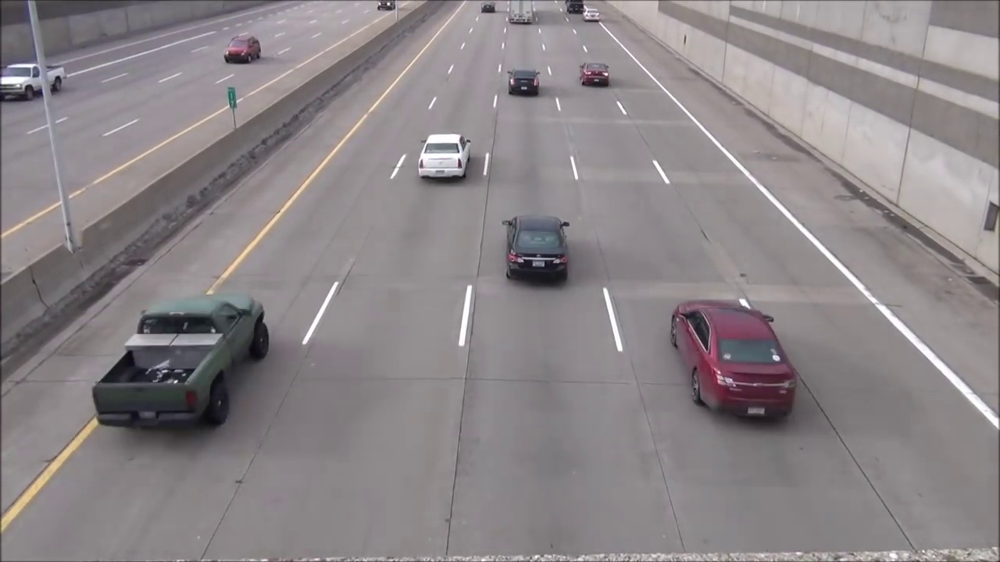
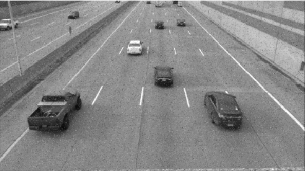
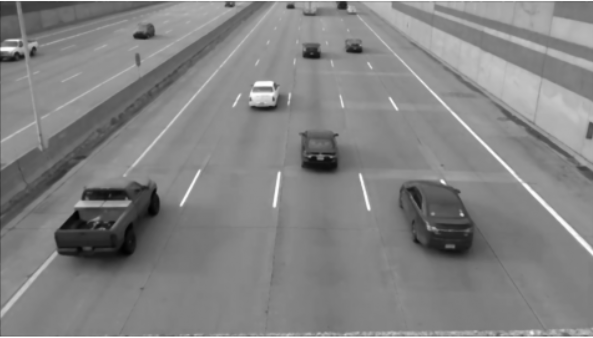

# 🖼️ Image Smoothing in Action: Mean vs. Median vs. Gaussian

[](https://opensource.org/licenses/MIT) [](https://www.python.org/downloads/) [](https://opencv.org/) [](https://numpy.org/)

This repository contains a project for a Digital Signal Processing course. Its purpose is to demonstrate and compare the effectiveness of several basic smoothing techniques for reducing salt-and-pepper noise in CCTV images.

---

## ✨ Key Features

- **Multi-Image Processing**: Capable of processing multiple images in a single run.
- **Noise Simulation**: Artificially adds salt-and-pepper noise to simulate real-world scenarios.
- **Filter Comparison**: Implements three popular filters:
  - **Mean Filter**: A simple averaging technique.
  - **Median Filter**: A robust noise reduction technique.
  - **Gaussian Filter**: A smoothing technique with natural-looking results.
- **Comparative Visualization**: Displays a side-by-side comparison for easy analysis.

---

## 📸 Results Showcase

Here is an example of the enhancement results on one of the images. It clearly shows how the **Median Filter** successfully removes almost all the noise while preserving image details.

| Original Image | Noisy Image | Median Filter Result |
| :----------: |:-------------: | :-------------: |
|  |  |  |


---

## 🚀 Installation & Setup

To run this project on your local machine, follow these steps.

1.  **Clone this repository:**
    ```bash
    git clone [https://github.com/Mystery-World3/Image-Smoothing-in-Action-Mean-vs.-Median-vs.-Gaussian.git](https://github.com/Mystery-World3/Image-Smoothing-in-Action-Mean-vs.-Median-vs.-Gaussian.git)
    cd Image-Smoothing-in-Action-Mean-vs.-Median-vs.-Gaussian
    ```

2.  **Create and activate a virtual environment (highly recommended):**
    ```bash
    python -m venv venv
    # Windows
    .\venv\Scripts\activate
    # macOS / Linux
    source venv/bin/activate
    ```

3.  **Install all the required dependencies:**
    ```bash
    pip install -r requirements.txt
    ```

---

## ▶️ How to Use

1.  Place your image files (e.g., `.jpg`, `.png`) inside the `assets` folder.
2.  Open the `cctv.ipynb` file using Jupyter Notebook or VS Code.
3.  Update the `daftar_file` list with the filenames of the images you want to process.
    ```python
    # Example inside the notebook
    daftar_file = [
        'assets/cctv.jpg', 
        'assets/cctv2.jpg',
        # Add your files here...
    ]
    ```
4.  Run all cells in the notebook to see the results instantly!

---

## 🧑‍💻 Development Team

This project is a collaborative work by:

* Muhammad Akmal Najib Gunawan
* Mhd Nursdin Al-kahfi
* Hasbi Abdullah
* Ghulam Musthofa
* Muhammad Averoes Irfan
* Muhammad Mishbahul Muflihin

---

## 📄 License

This project is licensed under the MIT License.
